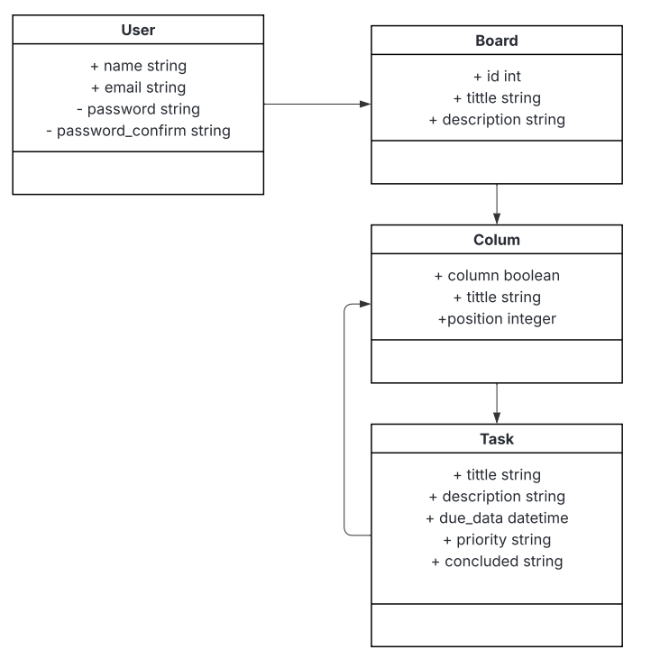
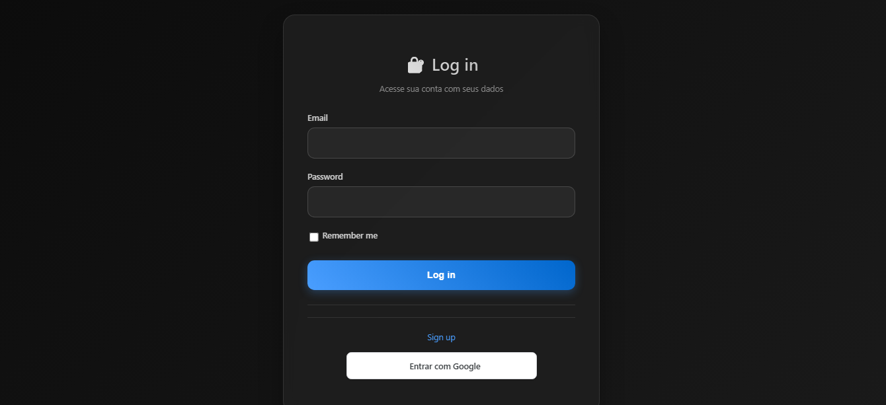
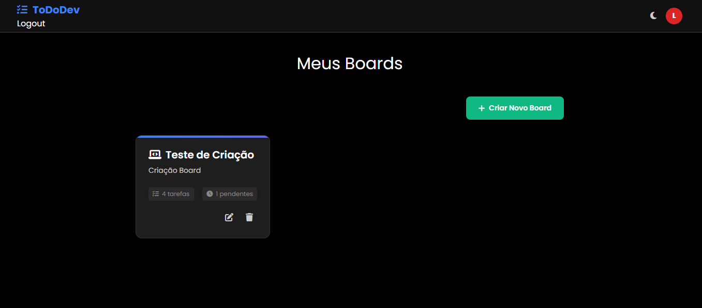
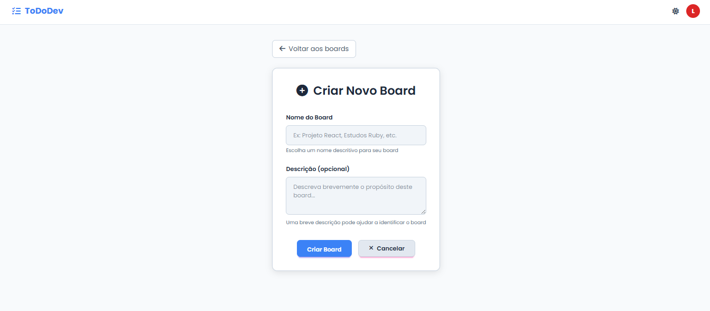
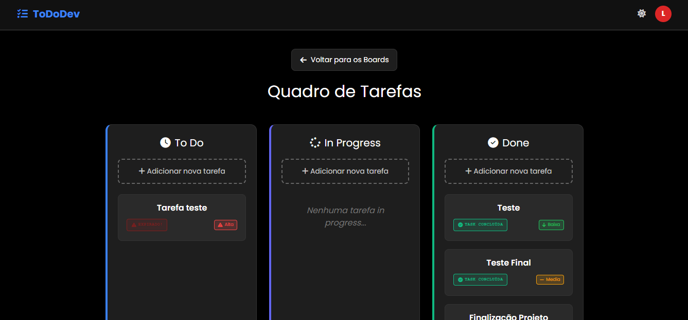
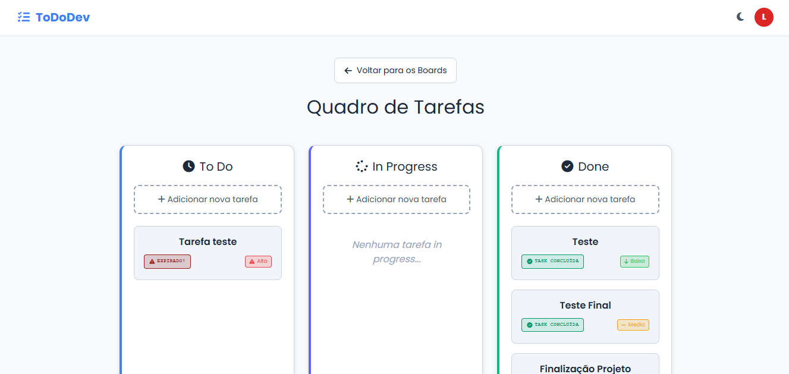
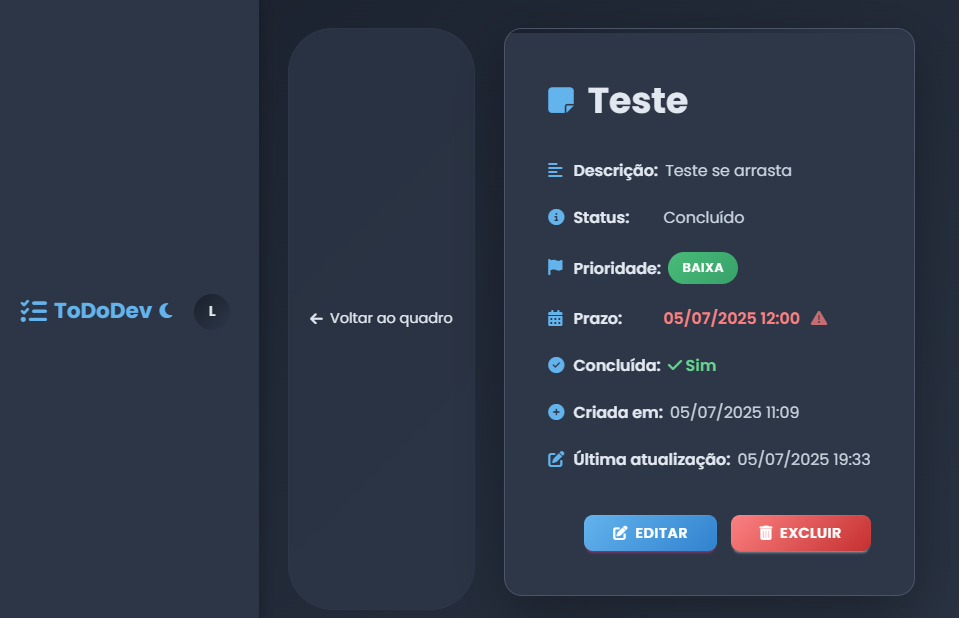
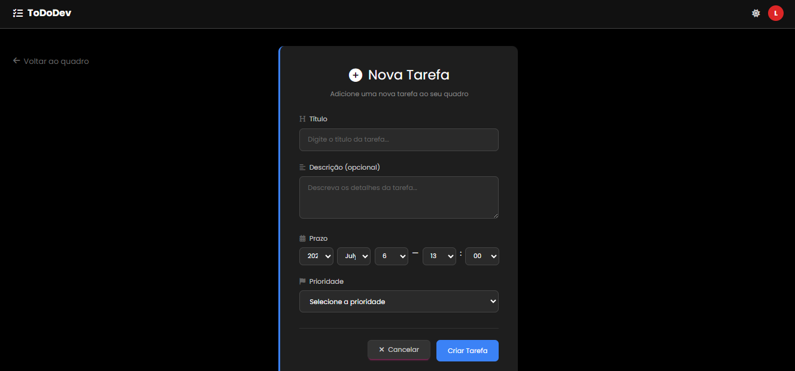

# ✅ ToDoThat — Organização Pessoal Inteligente

> Uma aplicação Ruby on Rails para gerenciar tarefas em quadros estilo Kanban, com autenticação segura, etiquetas personalizadas e visual moderno com TailwindCSS.

## 📌 Sumário
- [🧠 Visão Geral](#-visão-geral)
- [🚀 Tecnologias Utilizadas](#-tecnologias-utilizadas)
- [⚙️ Como Executar Localmente](#️-como-executar-localmente)
- [🗃️ Modelagem e Relacionamentos](#️-modelagem-e-relacionamentos)
- [🎨 Interface e Funcionalidades](#-interface-e-funcionalidades)
- [📦 Deploy e Variáveis de Ambiente](#-deploy-e-variáveis-de-ambiente)
- [👨‍💻 Autor](#-autor)

---

## 🧠 Visão Geral

O **ToDoThat** é um app web que permite que usuários criem e gerenciem quadros de tarefas em estilo Kanban. Idealizado para uso pessoal ou em equipe, ele permite:

- Criar múltiplos quadros
- Adicionar colunas customizadas (como “A Fazer”, “Em Progresso”, “Concluído”)
- Adicionar tarefas com prazo, dificuldade, prioridade e etiquetas
- Autenticação com e-mail e senha (Devise)
- Implantação na Render com banco de dados PostgreSQL

---

## 🚀 Tecnologias Utilizadas

- **Ruby** 3.2.2
- **Rails** 8.0.2
- **PostgreSQL** (banco de dados relacional)
- **TailwindCSS** + **DaisyUI** + **CSS puro** (estilização e componentes)
- **Devise** (autenticação)
- **Stimulus** (comportamentos JS leves)
- **Turbo** (atualizações em tempo real)

---

## ⚙️ Como Executar Localmente

### Pré-requisitos
- Ruby, Rails e PostgreSQL instalados

```bash
# Clone o repositório
git clone https://github.com/FelipeOliveira22/to-do-repository
cd to-do-repository

# Instale as gems
bundle install

# Instale dependências JS
npm install

# Configure o banco de dados
rails db:create db:migrate db:seed

# Inicie o servidor
rails s

```

## 🗃️ Modelagem e Relacionamentos



### 🔐 User
- Autenticado via Devise
- `has_many :boards`

### 🧱 Board
- Pertence a um usuário
- `has_many :columns`
- Atributos: `title`, `description`, `user_id`

### 📁 Column
- Pertence a um board
- `has_many :tasks`
- Atributos: `title`, `position`, `is_done_column`

### ✅ Task
- Pertence a uma coluna
- Atributos: `title`, `description`, `due_date`, `priority`, `difficulty`, `concluded_at`

## 🎨 Interface e Funcionalidade

- Autenticação de usuário (Devise)
- Criar quadros, colunas e tarefas
- Interface Kanban com drag & drop (SortableJS)
- Etiquetas coloridas
- Datas de vencimento e indicadores de prioridade
- Design responsivo com Tailwind e DaisyUI
- Modo Claro e Escuro para todas as Telas
- AUtenticação com Google
- Conexão com Google Agenda

# Seguem as Principais Telas:








---

## 📦 Deploy e Variáveis de Ambiente

O app está implantado na **Render** com banco de dados PostgreSQL. As seguintes variáveis devem ser configuradas:

| Chave             | Descrição                       |
|------------------ |---------------------------------|
| `RAILS_MASTER_KEY`| Chave do Rails                  |
| `PGDATABASE`      | Nome do banco (Render)          |
| `PGHOST`          | Host do banco (Render)          |
| `PGPASSWORD`      | Senha do banco (Render)         |
| `PGPORT`          | Porta (normalmente 5432)        |
| `PGUSER`          | Usuário do banco (Render)       |
| `WEB_CONCURRENCY` | Nº de workers do Puma (opcional)|

---

## 👨‍💻 Autor

Feito com 💙 por **Felipe Oliveira**  
[🔗 LinkedIn](https://www.linkedin.com/in/felipe-oliveira22/)  
[✉️ Email](mailto: lipenogueira33@email.com)  

---

Se curtiu, deixe uma ⭐ no projeto!
